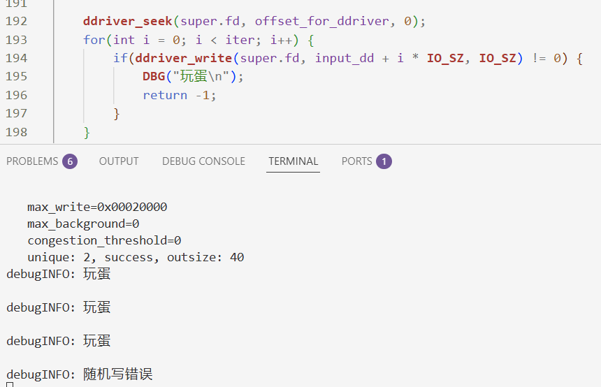
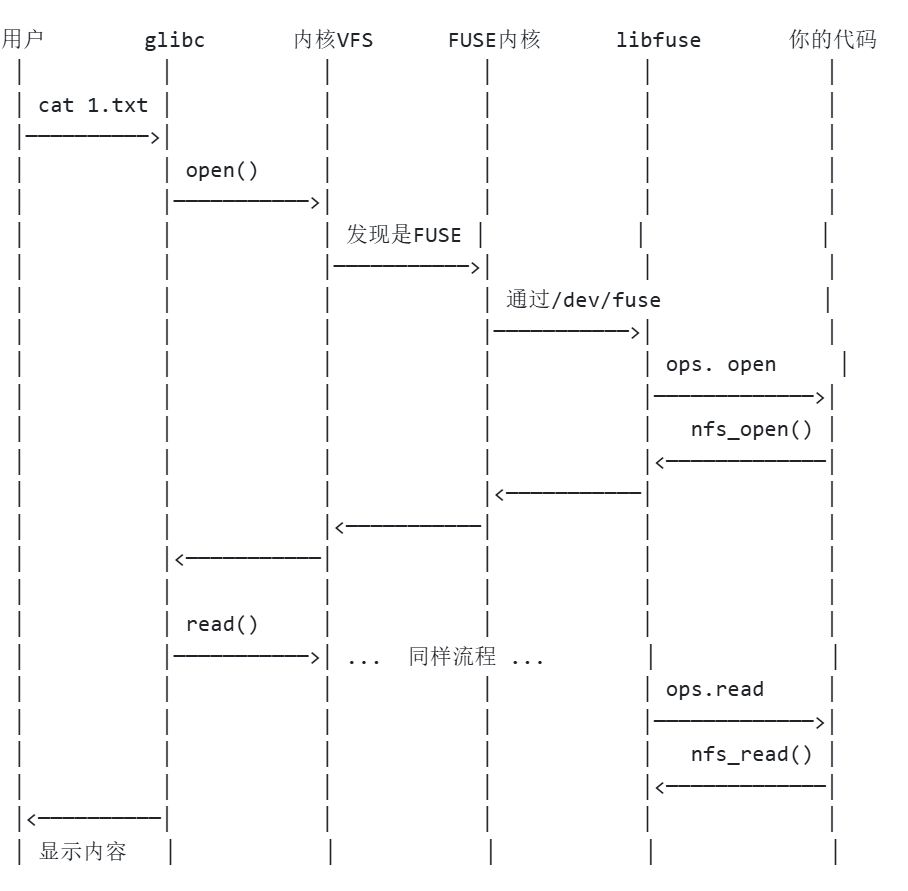

# user-land-filesystem, a simple implement of EXT2 filesystem
## 世界破破烂烂，小猫缝缝补补

debug log:

---
12.12
* is_mounted 没有即时刷新到磁盘，造成下次加载remount分支无法进入
* super->inode_table 没有必要维护， 属于开发遗留
---
12.13
* 需要解决一个全新挂载的问题， 新增维护nfs_dentry_d (on disk)
* 注意，把磁盘全部读进来很不经济， general_find是在ram端全部重建完成的前提下写的， 如果要实现按需读取目录，需要重写面向磁盘的general_find
* 注意 alloc_inode 过后没有传buf往里面写数据
---
12.14
* root_dentry 存到super里面， 指向第一个inode， 是最经济的
* 存疑， rebuilt_by_inode(), nfs_inode* super按值传递调用了很深的栈，会有问题吗？
* 修复原先malloc 垃圾值问题， 尤其在super初始化的时候，造成了干扰
* gdb调试解决了几个段错误， 现在已经成功进入is_init == 0 的分支了， 可能super_disk上一次写入的时候不完全, 现在真是知道安插打印信息了！！血泪！
* 一个有价值的bug， memcpy: super_disk ---> super 的时候， 上一次旧指针被拷贝进去， 访问造成内存破坏，每次程序运行，操作系统分配的虚拟地址都不同，指针不能持久化到磁盘
12.15
* mkdir过后应该是2个inode， 现在是三个， 而且bitmap中的三个点是间隔的， 这是重要的错误。 分配逻辑未按照预期
* 经排查， 发现原思路在sync处重新按每个inode写bitmap，而且是从disk读了再写，开销浪费大
* remount过后，没有额外操作，多出来了10000010， 间隔分配
* 经排查， alloc_inode耦合了太多功能， 多次重写了位图
---
12.20

* 随手安插dbg信息和返回数值， 真是血泪， debug 2h， 二分法一点点插入断点， dump bitmap对照。我觉得不可能在这种调用地方出错，结果就是在这里，机器不会骗人！
* 示范代码的ddriver注释有问题， 仍然不清楚问题出在哪里, 确定ddriver_open返回fd正确， 确定dump bitmap出错
* 离谱， 在cqh的代码上也dump不了， 没法debug就没法确定问题， 离谱了
* 使用dump_map过后， 根本没有变化， 真离谱
* 现在我猜测， 是成功写进去了的， 就是inode bit = 3的问题， 本来应该等于2
---
12.22
* 添加了bitmap_dump函数， 直接用现成的轮子就是爽啊
* 果然bitmap的init and remount write/read 都是没有问题的
* 无法重新ls上一次创建的文件
* 找到了 nfs_utils.c:454 checknum 错误！ 错了没有添加打印信息， 真是血泪， 没有添加信息更为闹心
* 找到问题, alloc inode 的时候， dentry->ino恒为0
* 原来是mkdir时候， 除了维护ram中的树结构， 还要维护inode的data（注意以dentry_d）格式写入， sync时才会成功刷回磁盘
---
12.23
* 成功实现remount后ls功能正常， 之前的错误就是因为inode管理下的dentry没有真正写入inode所属的data区， 后者才是在sync时真正被写入磁盘的信息！
* 现在还有的问题： 其实我的这个data bitmap是虚设，因为目前的实现采用预先计算的线性映射分配数据区空间， 每个inode对应的data段是连续分配的，如果利用data bitmap， 将inode.direct_data 改成指针数组， 就可以实现空闲块驱动的数据块布局现在代码耦合程度太高，可以后面再想办法改
* 准备实现附加功能
* 忘记添加钩子函数, fuse调用 -> 调用自己实现的函数 
* 这个图方便理解我们在干什么：

* new bug by gdb: nfs_read's restore_inode will replace inode already exists!!